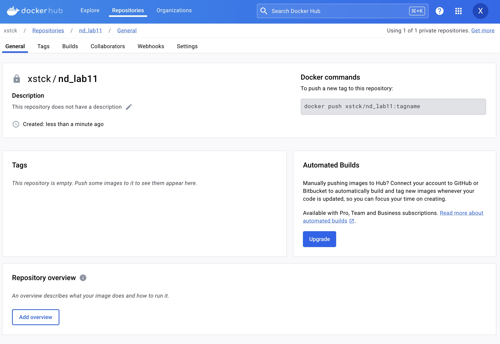
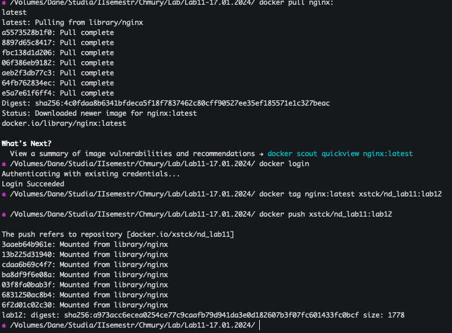
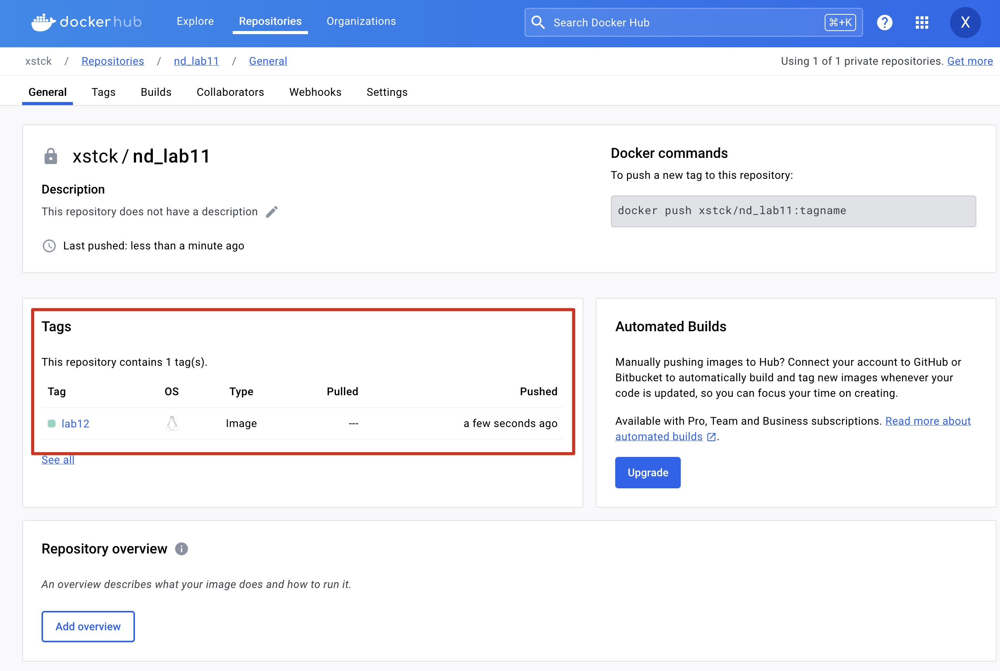
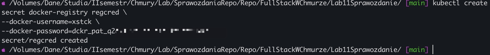
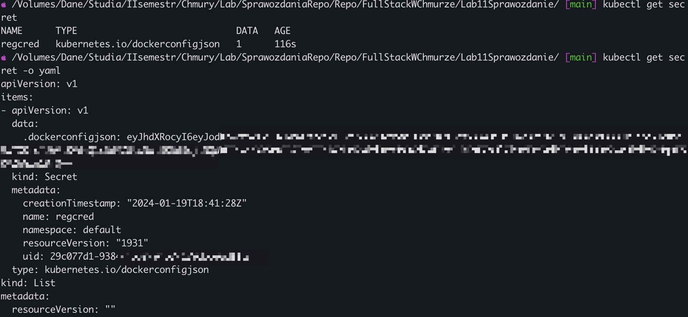
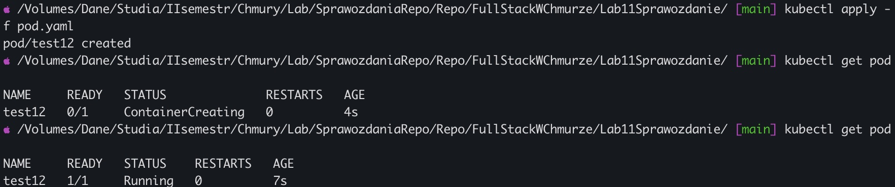
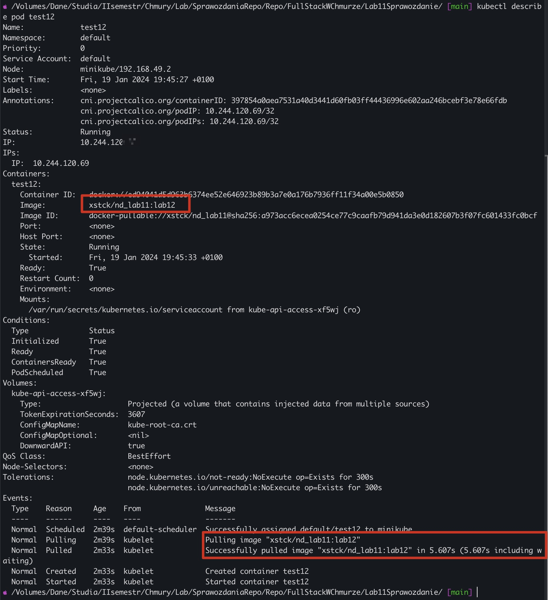

# Lab11 - Sprawozdanie

## Polecenie 1

Należy założyć nowe, PRYWATNE repozytorium na DockerHub (nazwa repo dowolna).

### Odpowiedź



## Polecenie 2

Do tego repo należy przesłać obraz serwera Nginx z nowym tag-iem: lab12.

### Odpowiedź




## Polecenie 3

Należy opracować manifest Pod-a w domyślnej przestrzeni nazw i o nazwie test12, który w oparciu o odpowiednio skonfigurowany obiekt Secret, będzie wykorzystywał obraz znajdujący się na utworzonym w p. 1, prywatnym repozytorium.

### Odpowiedź

Utworzenie Secret


Pobranie informacji o secret-cie


Plik yaml pod.yaml

```yaml
apiVersion: v1
kind: Pod
metadata:
  name: test12
spec:
  containers:
    - name: test12
      image: xstck/nd_lab11:lab12
  imagePullSecrets:
    - name: regcred
```

## Polecenie 4

Na podstawie opracowanego manifestu należy uruchomić Pod test12 i potwierdzić, że działa on poprawnie i wykorzystuje właściwy obraz.

### Odpowiedź

Uruchomienie oraz zweryfikowanie działania poda test12


Weryfikacja wykorzystywania przez pod test12 właściwego obrazu (xstck/nd_lab11:lab12)

