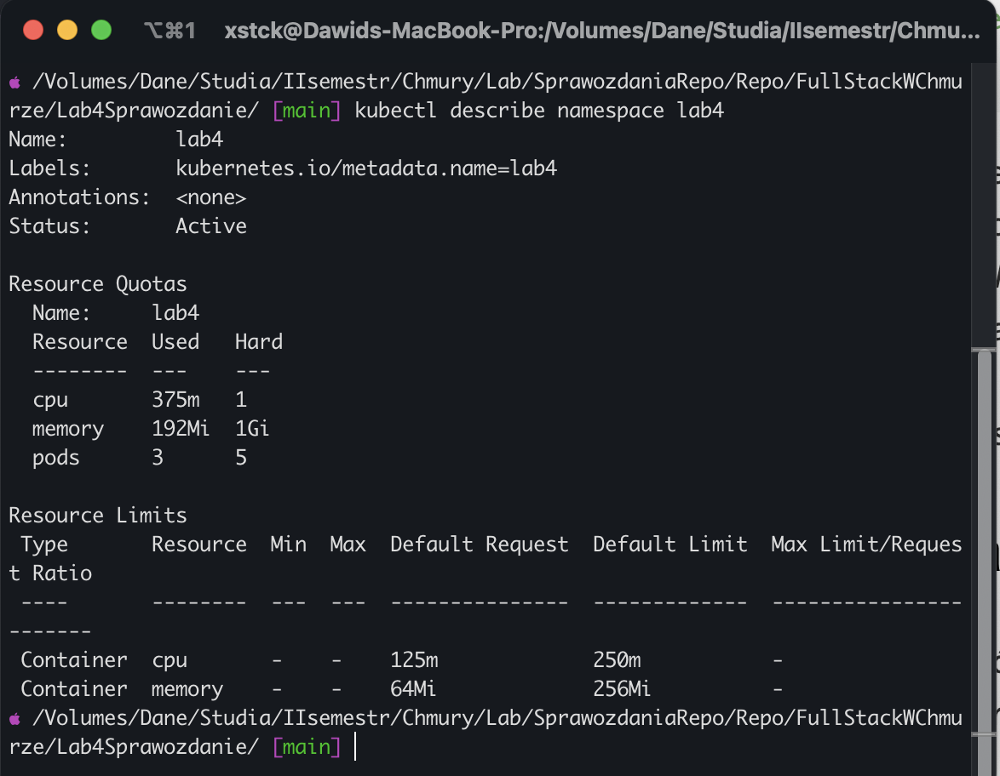
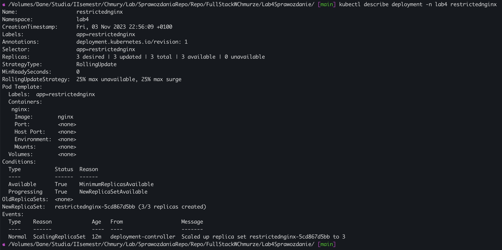
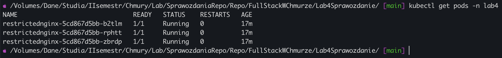
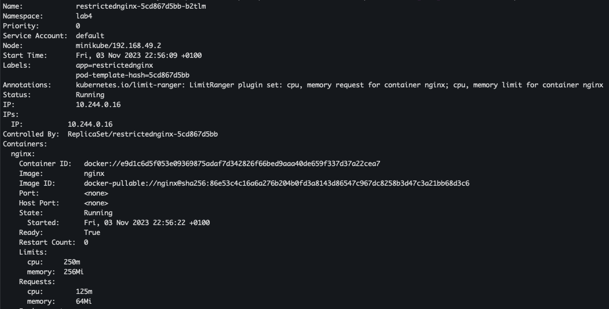
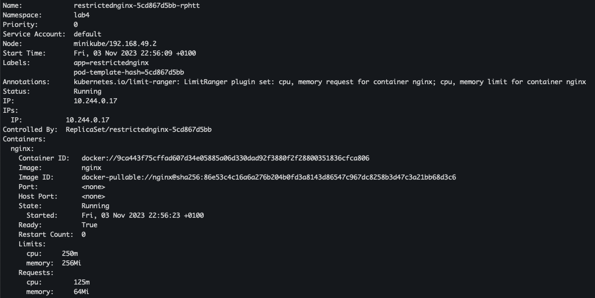
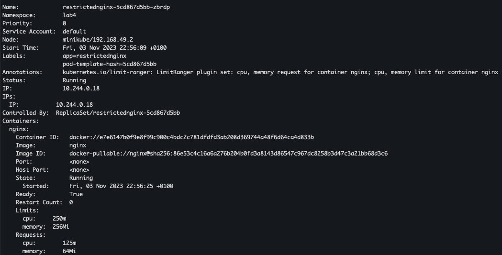

# Lab4 - Zaawansowana konfiguracja pod-ów. Zarządzanie zasobami. Job oraz CronJob

`Readme.md` zawiera opis rozwiązania zadania.

## Zadanie

1. Utwórz przestrzeń nazw o nazwie lab4, w której można uruchomić 5 Podów i dostępna jest całkowita ilość 1000 millicore i 1 GiB RAM
   <br>
2. Uruchom Deployment o nazwie restrictednginx w przestrzeni nazw lab4 z 3 pod-ami gdzie każdy Pod początkowo żąda: 64 MiB RAM oraz 125m CPU , a górny limit zasobów to 256 MiB RAM oraz 250m CPU.
   <br>
3. Potwierdź poprawność uruchomienia tych pod-ów za pomocą wybranych samodzielnie poleceń.

## Rozwiązanie

**1. Utwórz przestrzeń nazw o nazwie lab4, w której można uruchomić 5 Podów i dostępna jest całkowita ilość 1000 millicore i 1 GiB RAM**

- Utworzenie przestrzeni nazw za pomocą polecenia:
  _kubectl create namespace lab4_
  <br>
- Konfiguracja przestrzeni nazw by można było uruchomić w niej 5 podów i by była dostępna całkowita ilość 1000milicore i 1GiB RAM
  Plik ResourceQuota.yaml:

```yaml
apiVersion: v1
kind: ResourceQuota
metadata:
  name: lab4
spec:
  hard:
    pods: "5"
    cpu: "1000m"
    memory: 1Gi
```

- Po utworzeniu pliku, w celu wprowadzenia konfiguracji do przestrzeni nazw, należy wykonać polecenie:
  _kubectl apply -n lab4 -f ResourceQuota.yaml_

**2. Uruchom Deployment o nazwie restrictednginx w przestrzeni nazw lab4 z 3 pod-ami gdzie każdy Pod początkowo żąda: 64 MiB RAM oraz 125m CPU , a górny limit zasobów to 256 MiB RAM oraz 250m CPU.**

- Utworzenie pliku _LimitRange.yaml_ z limitami dla podów:
  Plik _LimitsRange.yaml_

```yaml
apiVersion: v1
kind: LimitRange
metadata:
  name: lab4
spec:
  limits:
    - default:
        memory: 256Mi
        cpu: 250m
      defaultRequest:
        cpu: 125m
        memory: 64Mi
      type: Container
```

- Po utworzeniu pliku, w celu nałożenia limitów, należy wykonać polecenie:
  _kubectl apply -n lab4 -f LimitRange.yaml_
  <br>
- Utworzenie manifestu (restrictedNginxDeployment.yaml) dla deploymentu za pomocą polecenia:
  _kubectl create deployment restrictednginx -n lab4 -
  -replicas=3 --image=nginx --dry-run=client -o yaml > restrictedNginxDeployment.y
  aml_
  <br>
- Plik _restrictedNginxDeployment.yaml_

```yaml
apiVersion: apps/v1
kind: Deployment
metadata:
  creationTimestamp: null
  labels:
    app: restrictednginx
  name: restrictednginx
  namespace: lab4
spec:
  replicas: 3
  selector:
    matchLabels:
      app: restrictednginx
  strategy: {}
  template:
    metadata:
      creationTimestamp: null
      labels:
        app: restrictednginx
    spec:
      containers:
        - image: nginx
          name: nginx
          resources: {}
status: {}
```

- Po utworzeniu pliku należy uruchomić deployment za pomocą polecenia:
  _kubectl -n lab4 apply -f restrictedNginxDeployment.yaml_

**3. Potwierdź poprawność uruchomienia tych pod-ów za pomocą wybranych samodzielnie poleceń.**

- Weryfikacja konfiguracji przestrzeni nazw za pomocą polecenia:
  _kubectl describe namespace lab4_
  
  <br>
- Weryfikacja utworzonego deployment-u za pomocą polecenia:
  _kubectl describe deployment -n lab4 restrictednginx_
  
  <br>
- Weryfikacja działania utworzonych podów za pomocą polecenia:
  _kubectl get pods -n lab4_
  
  <br>
- Weryfikacja limitów podów za pomocą polecenia:
  _kubectl describe pod -n lab4_
  (fragmenty)
  **Pod I**
  
  **Pod II**
  
  **Pod III**
  
