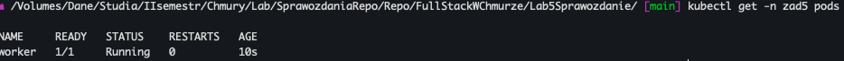
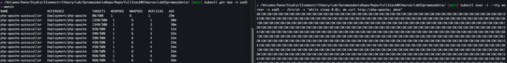

# Lab5 - Obiekty Deployment. Skalowanie wdrożeń. Rola etykiet i selektorów. Autoskalowanie w klastrach Kubernetes

`Readme.md` zawiera opis rozwiązania zadania.

## Zadanie przygotowawcze

Całość zadania ma być zrealizowana w przestrzeni nazw (namespace) o nazwie zad5. Na wstępie należy utworzyć przestrzeń nazw zad5.

#### Rozwiązanie

Utworzenie przestrzeni nazw za pomocą polecenia:
_kubectl create namespace zad5_

## Zadanie 1

Utworzyć plik yaml tworzący dla przestrzeni nazw zad5 zestaw ograniczeń na zasoby (quota) o następujących parametrach:

- maksymalna liczba Pod-ów: 10
- dostępne zasoby CPU: 2 CPU (2000m)
- dostępna ilość pamięci RAM: 1,5Gi

#### Rozwiązanie

Konfiguracja przestrzeni nazw by można było uruchomić w niej 10 podów i by była dostępna całkowita ilość 2000m i 1.5GiB RAM
Plik ResourceQuota.yaml:

```yaml
apiVersion: v1
kind: ResourceQuota
metadata:
  name: resource-quota
  namespace: zad5
spec:
  hard:
    pods: "10"
    cpu: "2000m"
    memory: 1.5Gi
```

## Zadanie 2

Utworzyć plik yaml tworzący Pod-a w przestrzeni nazw zad5 o nazwie worker. Pod ma bazować na obrazie nginx i mieć następujące ograniczenia na wykorzystywane zasoby:

```yaml
limits:
  memory: 200Mi
  cpu: 200m
requests:
  memory: 100Mi
  cpu: 100m
```

#### Rozwiązanie

Plik yaml zawierający konfigurację poda o nazwie worker.
Plik WorkerPod.yaml

```yaml
apiVersion: v1
kind: Pod
metadata:
  name: worker
  namespace: zad5
spec:
  containers:
    - name: nginx-container
      image: nginx
      resources:
        limits:
          memory: "200Mi"
          cpu: "200m"
        requests:
          memory: "100Mi"
          cpu: "100m"
```

## Zadanie 3

Bazując na przykładzie application/php-apache.yaml z instrukcji do lab4 i/lub z dokumentacji Kubernetes: https://kubernetes.io/docs/tasks/run-application/horizontal-pod-autoscale-walkthrough/ należy zmodyfikować wskazany wyżej plik yaml tak by obiekty Deployment i Service utworzone zostały w przestrzeni nazw zad5. Jednocześnie obiekt Deployment ma mieć następujące ograniczenia na wykorzystywane zasoby:

```yaml
limits:
  memory: 250Mi
  cpu: 250m
requests:
  memory: 150Mi
  cpu: 150m
```

#### Rozwiązanie

Plik php-apache.yaml (z dokumentacji Kubernetes) **przed modyfikacjami**:

```yaml
apiVersion: apps/v1
kind: Deployment
metadata:
  name: php-apache
spec:
  selector:
    matchLabels:
      run: php-apache
  template:
    metadata:
      labels:
        run: php-apache
    spec:
      containers:
        - name: php-apache
          image: registry.k8s.io/hpa-example
          ports:
            - containerPort: 80
          resources:
            limits:
              cpu: 500m
            requests:
              cpu: 200m
---
apiVersion: v1
kind: Service
metadata:
  name: php-apache
  labels:
    run: php-apache
spec:
  ports:
    - port: 80
  selector:
    run: php-apache
```

**Po modyfikacjach:**
Plik php-apache-afterModifications.yaml

```yaml
apiVersion: apps/v1
kind: Deployment
metadata:
  name: php-apache
  namespace: zad5
spec:
  selector:
    matchLabels:
      run: php-apache
  template:
    metadata:
      labels:
        run: php-apache
    spec:
      containers:
        - name: php-apache
          image: registry.k8s.io/hpa-example
          ports:
            - containerPort: 80
          resources:
            limits:
              memory: 250Mi
              cpu: 250m
            requests:
              memory: 150Mi
              cpu: 150m
---
apiVersion: v1
kind: Service
metadata:
  name: php-apache
  labels:
    run: php-apache
  namespace: zad5
spec:
  ports:
    - port: 80
  selector:
    run: php-apache
```

## Zadanie 4

Należy utworzyć plik yaml definiujący obiekt HorizontalPodAutoscaler, który pozwoli na autoskalowanie wdrożenia (Deployment) php-apache z zastosowaniem następujących parametrów:

```yaml
minReplicas: 1
maxReplicas: ???????
targetCPUUtilizationPercentage: 50
```

Wartość maxReplicas należy określić samodzielnie, tak by nie przekroczyć parametrów quoty dla przestrzeni nazw zad5. W sprawozdaniu należy uzasadnić dobór.

#### Rozwiązanie

Plik yaml definiujący obiekt HorizontalPodAutoscaller:
Plik HorizontalPodAutoscaller.yaml

```yaml
apiVersion: autoscaling/v1
kind: HorizontalPodAutoscaler
metadata:
  creationTimestamp: null
  name: php-apache
  namespace: zad5
spec:
  maxReplicas: 6
  minReplicas: 1
  scaleTargetRef:
    apiVersion: apps/v1
    kind: Deployment
    name: php-apache
  targetCPUUtilizationPercentage: 50
```

##### Uzasadnienie wybrania **maxReplicas: 6**

Jeśli pojedynczy deployment ma limit zasobów CPU: 250m i pamięci: 250Mi, to maksymalna liczba replik, która mieści się w limicie cpu: "2000m" i memory: 1.5Gi będzie zależała od tych wartości.

Ograniczenie dla pojedynczego deployment-u:
CPU: 250m
Pamięć: 250Mi

Aby obliczyć maksymalną liczbę replik, należy podzielić dostępne zasoby przestrzeni (CPU i pamięć) przez zasoby pojedynczego deployment-u:

Dostępne zasoby CPU: 2000m
Dostępna pamięć: 1.5Gi (1536Mi)

W przypadku, gdy jeden deployment wykorzystuje 250m CPU i 250Mi pamięci, należy obliczyć wartość maxReplicas dla HorizontalPodAutoscaler na podstawie tych wartości:
Maksymalna liczba replik w obszarze CPU: 2000m / 250m = 8
Maksymalna liczba replik w obszarze pamięci: 1536Mi / 250Mi ≈ 6

Maksymalna liczba replik będzie ograniczona przez mniejszą z tych dwóch wartości, co oznacza, że maxReplicas dla HorizontalPodAutoscaler powinien wynosić **6**.

## Zadanie 5

Należy utworzyć obiekty zdeklarowane w opracowanych plikach yaml. Następnie potwierdzić ich poprawne uruchomienie za pomocą samodzielnie dobranego polecenia (poleceń).

#### Rozwiązanie

##### Uruchomienie konfiguracji przestrzeni nazw zad5

Należy wykonać polecenie:
_kubectl apply -f ResourceQuota.yaml_

Potwierdzenie poprawnego uruchomienia:


##### Uruchomienie poda Worker

Należy wykonać polecenie:
_kubectl apply -f WorkerPod.yaml_

Potwierdzenie poprawnego uruchomienia:


##### Uruchomienie deployment-u oraz service-u php-apache

Należy wykonać polecenie:
_kubectl apply -f php-apache-afterModifications.yaml_

Potwierdzenie poprawnego uruchomienia:


##### Uruchomienie HorizontalPodAutoscaler

Należy wykonać polecenie:
_kubectl apply -f HorizontalPodAutoscaller.yaml_

Potwierdzenie poprawnego uruchomienia:


## Zadanie 6

Ponownie, bazując na przykładach z instrukcji do lab5 i/lub linku podanego w punkcie 3, należy uruchomić aplikację generującą obciążenie dla aplikacji php-apache i tym samym inicjalizujące proces autoskalowania wdrożenia tej aplikacji. Za pomocą samodzielnie dobranych poleceń i wyniku ich działania proszę potwierdzić dobór parametrów z punktu 4.

### Rozwiązanie

Potwierdzenie doboru parametrów z punktu 4 zostało potwierdzone za pomocą polecenia:
_kubectl get hpa -n zad5 --watch_

Przed uruchomieniem aplikacji generującej obiążenia:


Po uruchomieniu obciążenia (w kilku terminalach) za pomocą polecenia:
_kubectl exec -i --tty worker -n zad5 -- /bin/sh -c "while sleep 0.01; do curl http://php-apache; done"_


