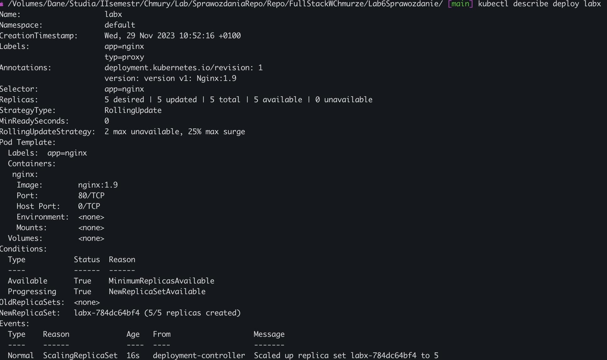
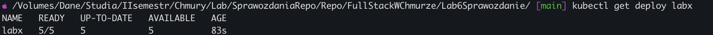
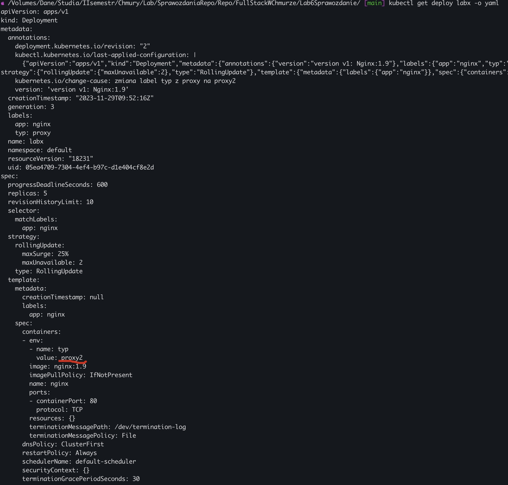
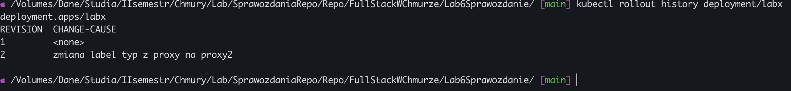

# Lab6 - Aktualizacja parametrów wdrożenia aplikacji. Strategie aktualizacji.. Historia aktualizacji i przywracanie poprzednich wersji aplikacji

`Readme.md` zawiera opis rozwiązania zadania.

## Zadanie

Proszę utworzyć plik YAML, który będzie manifestem dla Deployment wykorzystującego obraz serwera Nginx. Należy zdefiniować wykorzystanie obrazu w wersji 1.9 oraz uruchomienie 5 replik serwera. Dodatkowo wdrożenie powinno mieć etykietę typ=proxy Następnie w tym pliku skonfigurować takie parametry strategi aktualizacji, aby w trakcie realizacji tej aktualizacji nie było więcej niż 2 Pod-y niedostępne w tym samym czasie. W opracowanym pliku YAML powinna również znaleźć się właściwa adnotacja, opisująca tą wersję aplikacji.

## Rozwiązanie

Plik YAML, będący manifestem dla Deploymeny, wykorzystujący obraz serwera Nginx.

Plik Lab6.yaml

```yaml
apiVersion: apps/v1
kind: Deployment
metadata:
  name: labx
  labels:
    app: nginx
    typ: proxy
  annotations:
    version: "version v1: Nginx:1.9"
spec:
  replicas: 5
  selector:
    matchLabels:
      app: nginx
  strategy:
    rollingUpdate:
      maxUnavailable: 2
    type: RollingUpdate
  template:
    metadata:
      labels:
        app: nginx
    spec:
      containers:
        - name: nginx
          image: nginx:1.9
          ports:
            - containerPort: 80
```

####Polecenia sprawdzające prawidłowe działanie deploymentu:

Polecenie: _kubectl describe deploy nginx-deployment_
Zrzut ekranu:


Polecenie: _kubectl get deploy nginxup_
Zrzut ekranu:


#### Aktualizacja label type=proxy na type=proxy2

Wykorzystane polecenie:
_kubectl set env deploy labx typ=proxy2_

Następnie została dodana adnotacja do zmiany za pomocą polecenia:
_kubectl annotate deployment labx kubernetes.io/change-cause='zmiana label typ z proxy na proxy2'_

Wynik polecenia: _kubectl get deploy labx -o yaml_
Zrzut ekranu:


Wynik polecenia: _kubectl rollout history deployment/labx_
Zrzut ekranu:

